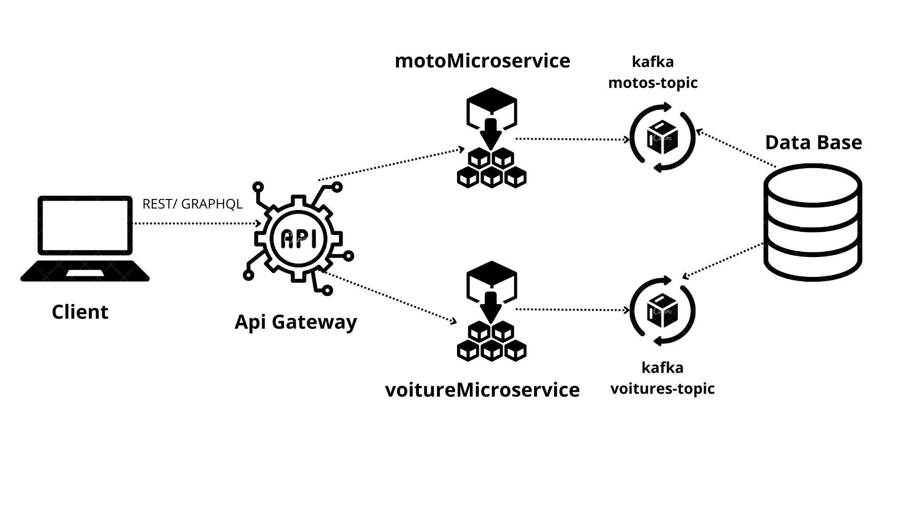

# microservice_project

this my project  microservice architecture pattern using nodejs , Mongo Db  , grpc , Rest , GraphQL and Kafka
Thanks to MR Gontara Salah which has inspired and given really good knowledge for setting up this project.

# Conception





# Technologies
**gRPC**: Used for efficient communication between microservices.


**GraphQL**: Implemented for flexible and efficient querying of data.


**REST**: RESTful APIs are used for exposing the services to external clients.

**Kafka** : is a distributed event streaming platform used for building real-time data pipelines and applications that can handle large volumes of data efficiently.


# VOITURE MICROSERVICE
Contains APIs related to creating a new voiture and getting voiture details.

**Rest :**


```http
 GET /voitures

```
**GraphQL :**


```graphql
query {
   voitures {
    id
    title
    description
  }
}

```

**Rest :**


```http
  POST /voiture

```

| Parameter   | Type     | Description                       |
| :-----------| :------- | :-------------------------------- |
| `title`      | `string` | **Required**.                     |
| `description`    | `string` | **Required**.                     |

**GraphQL :**

```graphql
mutation Mutation($title: String!, $description: String!) {
  addVoiture(title: $title, description: $description) {
    id
    title
    description
  }
}


{
  "title": "test",
  "description": "test"
}


```

# MOTO MICROSERVICE

Contains APIs related to creating a new moto and getting moto details.


**Rest :**


```http
 GET /motos

```

**GraphQL :**


```graphql
query {
   motos {
    id
    title
    description
  }
}

```
**Rest :**


```http
  POST /moto

```

| Parameter        | Type     | Description                       |
| :----------------| :------- | :-------------------------------- |
| `title`           | `string` | **Required**.                     |
| `description`    | `string` | **Required**.                     |


# Requirements

Ensure you have the following software installed on your local machine:

git

Node.js (version 12 or higher)

npm (version 6 or higher)

postgres

# Common setup

Clone the repo and install the dependencies.

git clone https://github.com/Aminetr14/Projet-microservices.git

`cd microservice_project`
`npm install`

# Run

To start the ApiGateway server, run the following

`nodemon apiGerway.js`

To start the Voiture server, run the following:


`node voitureMicroservice.js`


To start the Moto server, run the following:


`node motoMicroservice.js`

