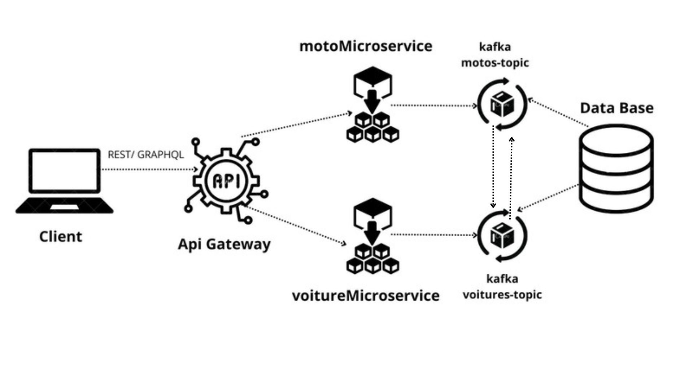

# <span style="color:blue;">microservice_project</span>

This is my project using a microservice architecture pattern with <span style="color:blue;">**Node.js**</span>, <span style="color:green;">**MongoDB**</span>, <span style="color:orange;">**gRPC**</span>, <span style="color:red;">**REST**</span>, <span style="color:purple;">**GraphQL**</span>, and <span style="color:brown;">**Kafka**</span>. Thanks to Mr. Gontara Salah for the inspiration and knowledge provided to set up this project.

# Conception



# Technologies

- <span style="color:orange;">**gRPC**</span>: Used for efficient communication between microservices.
- <span style="color:purple;">**GraphQL**</span>: Implemented for flexible and efficient querying of data.
- <span style="color:red;">**REST**</span>: RESTful APIs are used for exposing the services to external clients.
- <span style="color:brown;">**Kafka**</span>: A distributed event streaming platform used for building real-time data pipelines and applications that can handle large volumes of data efficiently.

# VOITURE MICROSERVICE

Contains APIs related to creating a new voiture and getting voiture details.

**REST:**

```http
GET /voitures


**GraphQL :**


```graphql
query {
   voitures {
    id
    title
    description
  }
}

```

**Rest :**


```http
  POST /voiture

```

| Parameter   | Type     | Description                       |
| :-----------| :------- | :-------------------------------- |
| `title`      | `string` | **Required**.                     |
| `description`    | `string` | **Required**.                     |

**GraphQL :**

```graphql
mutation Mutation($title: String!, $description: String!) {
  addVoiture(title: $title, description: $description) {
    id
    title
    description
  }
}


{
  "title": "test",
  "description": "test"
}


```

# MOTO MICROSERVICE

Contains APIs related to creating a new moto and getting moto details.


**Rest :**


```http
 GET /motos

```

**GraphQL :**


```graphql
query {
   motos {
    id
    title
    description
  }
}

```
**Rest :**


```http
  POST /moto

```

| Parameter        | Type     | Description                       |
| :----------------| :------- | :-------------------------------- |
| `title`           | `string` | **Required**.                     |
| `description`    | `string` | **Required**.                     |


# Requirements

Ensure you have the following software installed on your local machine:

git

Node.js (version 12 or higher)

npm (version 6 or higher)

postgres

# Common setup

Clone the repo and install the dependencies.

git clone https://github.com/Aminetr14/Projet-microservices.git

`cd microservice_project`
`npm install`

# Run

To start the ApiGateway server, run the following

`nodemon apiGerway.js`

To start the Voiture server, run the following:


`node voitureMicroservice.js`


To start the Moto server, run the following:


`node motoMicroservice.js`

